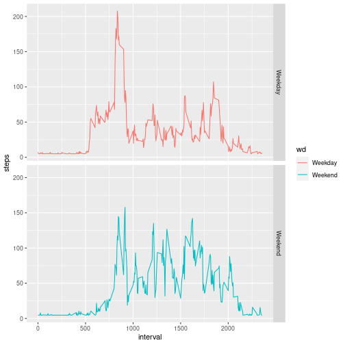

## Required Libraries


```r
library(data.table)
library(ggplot2)
```

## Loading and preprocessing the data


```r
unzip(zipfile = "activity.zip")
data_activity <- data.table::fread(file = "activity.csv", sep = ",", dec = ".")


str(data_activity)
```

```
## Classes 'data.table' and 'data.frame':	17568 obs. of  3 variables:
##  $ steps   : int  NA NA NA NA NA NA NA NA NA NA ...
##  $ date    : chr  "2012-10-01" "2012-10-01" "2012-10-01" "2012-10-01" ...
##  $ interval: int  0 5 10 15 20 25 30 35 40 45 ...
##  - attr(*, ".internal.selfref")=<externalptr>
```


## What is mean total number of steps taken per day?


```r
#Total number of steps per day
data_hist <- data_activity[!(steps == 0) & !(is.na(steps)) 
                           ,.("steps" = sum(steps))
                           , by = date]


#Histogram
hist(data_hist$steps, main = "Histogram - Numbers of steps taken per day")
```


```r
#Mean and Meian
data_hist[,.("Mean"    = mean(steps)
             ,"Median" = median(steps))]
```

```
##        Mean Median
## 1: 10766.19  10765
```


## What is the average daily activity pattern?


```r
data_patt <- data_activity[,.("steps" = mean(steps, na.rm = T)), interval][order(interval)]
plot(data_patt$interval
     , data_patt$steps
     , type = "l"
     , main = "Average daily activity pattern")
```


```r
#Interval that contain the maximum number of steps
data_patt[steps == max(steps), interval]
```

```
## [1] 835
```


## Imputing missing values


```r
#Total number missing values
nrow(data_activity[is.na(steps)])
```

```
## [1] 2304
```


```r
data_activity_no_NA <- copy(data_activity)

#Filling NA
data_activity_no_NA[,steps := as.numeric(steps)]
data_activity_no_NA[is.na(steps), steps := mean(data_activity$steps, na.rm = TRUE)]

#Total number of steps per day
data_hist_no_NA <- data_activity_no_NA[ ,.("steps" = sum(steps))
                                       , by = date]

#Histogram
hist(data_hist_no_NA$steps, main = "Histogram - Numbers of steps taken per day (w/o NA)")
```


```r
#Mean and Meian
data_hist_no_NA[,.("Mean"    = mean(steps)
                   ,"Median" = median(steps))]
```

```
##        Mean   Median
## 1: 10766.19 10766.19
```

Imputing missing data, especially using the mean, is a common method for handling gaps in a dataset. However, it does have several implications and potential impacts on the estimates and future analyses. Here's a example of the effects:

  - Bias
  - Variance Reduction
  - Data appear more normally distributed than it actually is (overestimation of Data Quality)
  - Influence on Statistical Inferences
  - Inflated estimates
  - ...
  

## Are there differences in activity patterns between weekdays and weekends?


```r
#Coverting date
data_activity_no_NA[, wd := weekdays(as.Date(date, "%Y-%m-%d"))]
data_activity_no_NA[, wd := ifelse(wd %like% "S", "Weekend", "Weekday")]
data_activity_no_NA[, wd := as.factor(wd)]

data_activity_no_NA_wd <- data_activity_no_NA[,.("steps" = mean(steps))
                                              , .(interval, wd)]

#Plot
p <- ggplot(data_activity_no_NA_wd, aes(x=interval, y=steps, group=wd, col=wd, fill=wd)) +
      geom_line() +
      facet_grid(rows = vars(wd))

p
```


